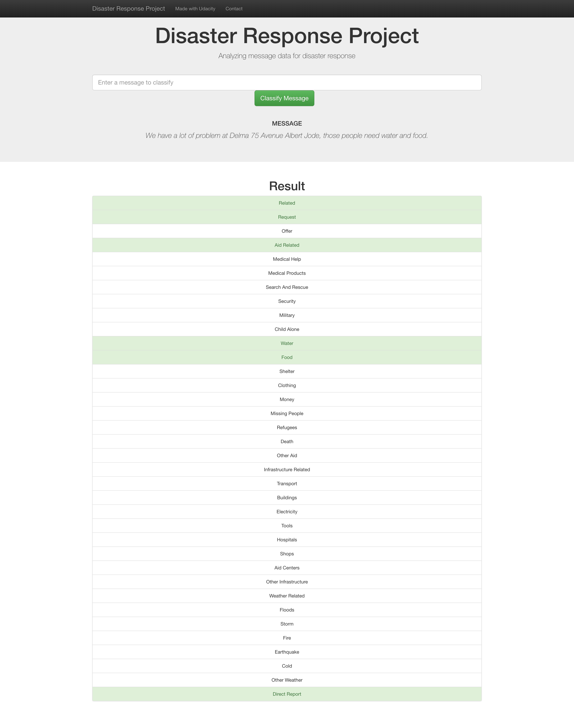

# Disaster Response Pipeline Project
1. Project Overview
In this project, I'll apply data engineering to analyze disaster data from Figure Eight to build a model for an API that classifies disaster messages.

data directory contains a data set which are real messages that were sent during disaster events. I will be creating a machine learning pipeline to categorize these events so that appropriate disaster relief agency can be reached out for help.

This project will include a web app where an emergency worker can input a new message and get classification results in several categories. The web app will also display visualizations of the data.

Here are a few screenshots of the web app.
File Description

    .
    ├── app     
    │   ├── run.py                           # Flask file that runs app
    │   └── templates   
    │       ├── go.html                      # Classification result page of web app
    │       └── master.html                  # Main page of web app    
    ├── data                   
    │   ├── disaster_categories.csv          # Dataset including all the categories  
    │   ├── disaster_messages.csv            # Dataset including all the messages
    │   └── process_data.py                  # Data cleaning
    ├── models
    │   └── train_classifier.py              # Train ML model           
    └── README.md

### Instructions: (Run run.py directly if DisasterResponse.db and claasifier.pkl already exist.)
1. Run the following commands in the project's root directory to set up your database and model.

    - To run ETL pipeline that cleans data and stores in database
        `python data/process_data.py data/disaster_messages.csv data/disaster_categories.csv data/DisasterResponse.db`
    - To run ML pipeline that trains classifier and saves
        `python models/train_classifier.py data/DisasterResponse.db models/classifier.pkl`

2. Run the following command in the app's directory to run your web app.
    `python run.py`

3. Go to http:" http://127.0.0.1:5000/"

